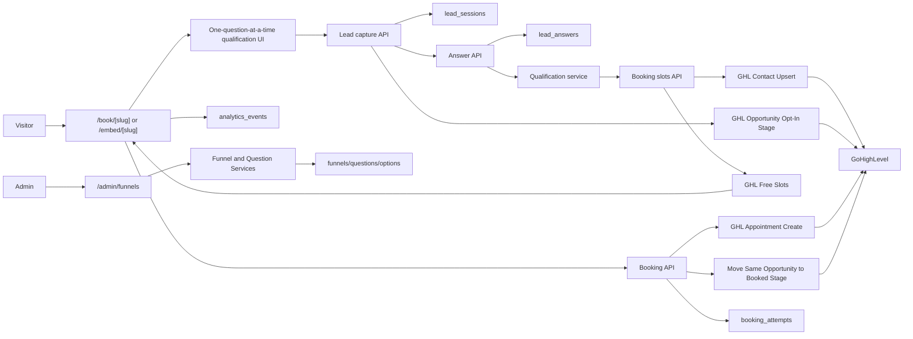

# Leadder Scheduler MVP

Leadder Scheduler is a conversion-first booking layer that captures and qualifies leads before showing GoHighLevel calendar availability.

GHL remains the system of record for contacts, opportunities, pipelines, appointments, workflows, reminders, and CRM records. Leadder owns funnel rendering, question flow, lead capture, qualification, routing readiness, booking UX, analytics, and the GHL handoff.

## Folder Structure

```text
app/
  (admin)/admin/
    ghl-connections/         Tenant-scoped GHL account connections
    funnels/                 Admin funnel and question builder
  api/
    analytics/               Event tracking endpoint
    bookings/                Slot lookup and appointment creation
    embed-snippets/          Generated iframe/popup snippets
    funnels/                 Auth-protected funnel CRUD API
    lead-sessions/           Lead capture, answers, abandonment
  book/[slug]/               Full-page public booking flow
  embed/[slug]/              Iframe-safe booking flow
  login/                     Supabase Auth sign-in
components/
  booking/                   Public booking flow UI
  ui/                        shadcn-style primitives
lib/
  analytics/                 Event tracking and aggregate metrics
  auth/                      Admin tenant and API auth helpers
  bookings/                  Booking orchestration service
  funnels/                   Funnel/question service layer
  ghl/                       Server-only GHL client/service
  lead-sessions/             Lead capture and qualification service
  supabase/                  Auth and service clients
  types/                     Database row contracts
  validation/                Zod schemas
supabase/
  migrations/                Scheduler schema and storage migrations
docs/
  architecture.md            Architecture, schema, setup, and risk notes
```

## Database Schema

Core MVP tables:

- `tenants`
- `tenant_members`
- `ghl_connections`
- `funnels`
- `questions`
- `question_options`
- `lead_sessions`
- `lead_status_history`
- `lead_answers`
- `booking_attempts`
- `analytics_events`

Migration files:

- `supabase/migrations/0001_leadder_scheduler.sql`
- `supabase/migrations/0002_seed_demo_funnel.sql`
- `supabase/migrations/0003_storage.sql`
- `supabase/migrations/0004_scheduler_hardening.sql`
- `supabase/migrations/0005_security_hardening.sql`

The older `supabase/001_initial_schema.sql` is retained as prior reference material and is not part of this Scheduler MVP migration path.

## Architecture Diagram



## Local Setup

1. Install dependencies:

   ```bash
   npm install
   ```

2. Create `.env.local` from `.env.example`:

   ```bash
   cp .env.example .env.local
   ```

3. Fill in:

   ```text
   NEXT_PUBLIC_SUPABASE_URL=
   NEXT_PUBLIC_SUPABASE_ANON_KEY=
   NEXT_PUBLIC_APP_URL=http://localhost:3000
   SUPABASE_SERVICE_ROLE_KEY=
   LEADDER_DEFAULT_TENANT_ID=00000000-0000-0000-0000-000000000001
   LEADDER_TOKEN_ENCRYPTION_KEY=
   LEADDER_DEMO_SLOT_MODE=true
   ```

   `LEADDER_DEFAULT_TENANT_ID` is a local-development convenience only. Production admin users must be linked through `tenant_members`.
   `LEADDER_DEMO_SLOT_MODE=true` enables safe local sample slots without GHL calls and is ignored in production.
   Generate `LEADDER_TOKEN_ENCRYPTION_KEY` with `openssl rand -base64 32`.

4. Apply Supabase migrations:

   ```bash
   supabase db push
   ```

5. Run the app:

   ```bash
   npm run dev
   ```

6. Open:

   - Admin: `http://localhost:3000/admin/funnels`
   - GHL connections: `http://localhost:3000/admin/ghl-connections`
   - Demo funnel: `http://localhost:3000/book/demo-consultation`
   - Demo embed: `http://localhost:3000/embed/demo-consultation`

For detailed hosted Supabase, demo seed, and local visual QA instructions, see `docs/local-development.md`.

## Supabase Setup

1. Create a Supabase project.
2. Run migrations in `supabase/migrations`.
3. Enable Supabase Auth email/password for admin users.
4. Create an admin user.
5. For multi-tenant auth, insert a `tenant_members` row linking the Supabase Auth `user_id` to a `tenant_id`.
6. Confirm the `funnel-assets` storage bucket exists from `0003_storage.sql`.
7. Add at least one GHL connection in `/admin/ghl-connections`.
8. Verify RLS policies from `0005_security_hardening.sql` are active.
9. Rotate each GHL token through `/admin/ghl-connections` so stored values are encrypted.

## Vercel Deployment

1. Push this repo to GitHub.
2. Import the project in Vercel.
3. Set environment variables from `.env.example`.
4. Set `NEXT_PUBLIC_APP_URL` to the production URL.
5. Run Supabase migrations before routing production traffic.
6. Deploy with the default Next.js build command:

   ```bash
   npm run build
   ```

## Verification

Current local verification:

```bash
npm run typecheck
npm run lint
npm run build
npm audit --audit-level=moderate
```

All passed. `next lint` prints a deprecation notice in Next 15, but returns clean.

## Remaining Implementation Tasks

- Build tenant membership management UI.
- Add token rotation and connection health checks.
- Add deeper analytics drilldowns for question-level dropoff and show/close/revenue metrics.
- Add per-question validation configuration UI.
- Add route/rules UI when advanced routing becomes part of scope.
- Add Playwright coverage for booking flow, admin CRUD, and embed rendering.
- Add production error reporting and request logging.
