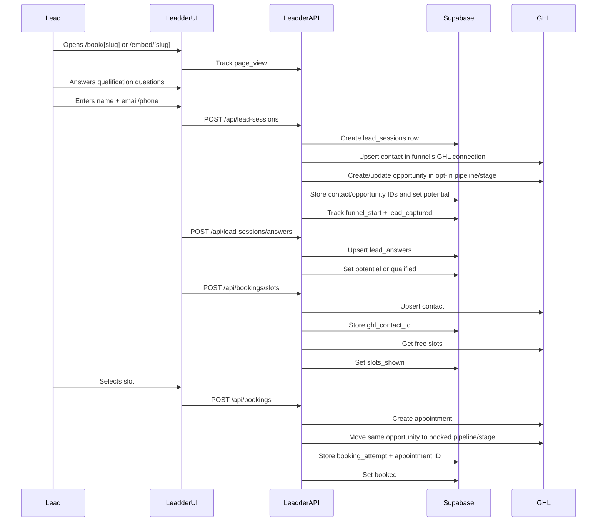

# Leadder Scheduler Architecture

## Product Boundary

Leadder Scheduler is not a replacement calendar. It is a qualification and booking UX layer in front of GoHighLevel.

Leadder owns:

- Funnel rendering
- Question flows
- Lead capture
- Qualification status
- GHL account routing
- GHL opportunity handoff
- Booking UI
- Funnel analytics

GHL owns:

- Contacts
- Opportunities
- Pipelines
- Appointments
- Workflows
- Reminders
- CRM records

## Request Flow

## Service Boundaries

- `lib/funnels/service.ts`: funnel, question, option, theme, and logo writes.
- `lib/lead-sessions/service.ts`: lead capture, answer normalization, qualification, status changes.
- `lib/bookings/service.ts`: GHL contact upsert, slot lookup, appointment creation, booking attempts.
- `lib/ghl/*`: server-only GHL HTTP boundary, tenant connection runtime config, opportunity handoff.
- `lib/analytics/service.ts`: durable event tracking and aggregate metrics.

React components call API routes or server actions. Business logic stays in services.

## GHL Integration Notes

The GHL API boundary is server-only. The browser never receives GHL tokens.

MVP endpoints:

- Contact upsert: `POST /contacts/upsert`
- Free slots: `GET /calendars/:calendarId/free-slots`
- Appointment creation: `POST /calendars/events/appointments`
- Search opportunity: `GET /opportunities/search`
- Create opportunity: `POST /opportunities/`
- Update opportunity: `PUT /opportunities/:id`

Each funnel references `ghl_connection_id`. All GHL calls resolve that funnel's connection and use its location ID, token, API base URL, and API version. Funnel-specific `calendar_id` overrides the connection default calendar.

`ghl_connections.private_token_ciphertext` stores a versioned AES-256-GCM ciphertext envelope. GHL tokens are encrypted before database storage and decrypted only server-side when constructing a GHL runtime config.

## Schema Design

The schema is multi-tenant from the first migration:

- Tenant-owned configuration: `ghl_connections`, `funnels`, `questions`, `question_options`
- Tenant-owned activity: `lead_sessions`, `lead_answers`, `booking_attempts`, `analytics_events`
- Admin membership: `tenant_members`

Questions, options, themes, slugs, calendar IDs, GHL connection IDs, opt-in pipeline destinations, booked-call pipeline destinations, embed settings, and future routing/scoring/disqualification settings are data-driven. Public routes load published funnel configuration by globally unique slug.

Future flow support is present through:

- `questions.conditional_logic`
- `questions.branching_logic`
- `funnels.routing_rules`
- `funnels.scoring_rules`
- `funnels.disqualification_rules`

## Status Model

`lead_sessions.status` supports:

- `started`
- `potential`
- `qualified`
- `slots_shown`
- `booked`
- `abandoned`
- `error`

`lead_status_history` records every status transition through database triggers.

## Analytics MVP

Raw events are written to `analytics_events`:

- `page_view`
- `funnel_start`
- `lead_captured`
- `qualified_lead`
- `slots_shown`
- `appointment_booked`
- `booking_error`
- `abandoned`

Rates are computed in service code for now. This keeps the table flexible for future reports without prematurely adding rollup infrastructure.

Admin funnel performance currently reports:

- Unique visitors
- Page views
- Opt-in count
- Opt-in rate
- Calls booked count
- Call booking rate
- Visitor to booked rate

Date filters support today, yesterday, last 7 days, last 30 days, and custom ranges.

## Security Review

- GHL credentials remain server-side.
- GHL tokens are encrypted at rest with `LEADDER_TOKEN_ENCRYPTION_KEY`.
- Admin UI is protected by Supabase Auth middleware when Supabase auth env vars are present.
- Admin API routes require an authenticated Supabase user in configured environments.
- Supabase service role is used server-side only.
- Public routes only receive published funnel configuration and lead/session IDs.
- RLS policies are defined in `0005_security_hardening.sql`.
- GHL tokens are never sent to browser code.

## Refactor Risks

- GHL response shapes should be validated against real customer calendars during integration QA.
- Tenant membership needs first-class UI before onboarding multiple agencies.
- Legacy plaintext GHL tokens must be rotated after deploying encryption.
- Analytics aggregation will need SQL views or materialized rollups when traffic grows.
- The question builder is intentionally functional, not polished; it should become a dedicated admin UX before non-technical users rely on it.
- Public slug routing is globally unique today. Custom domains or tenant pathing are needed if duplicate slugs across tenants become a product requirement.
